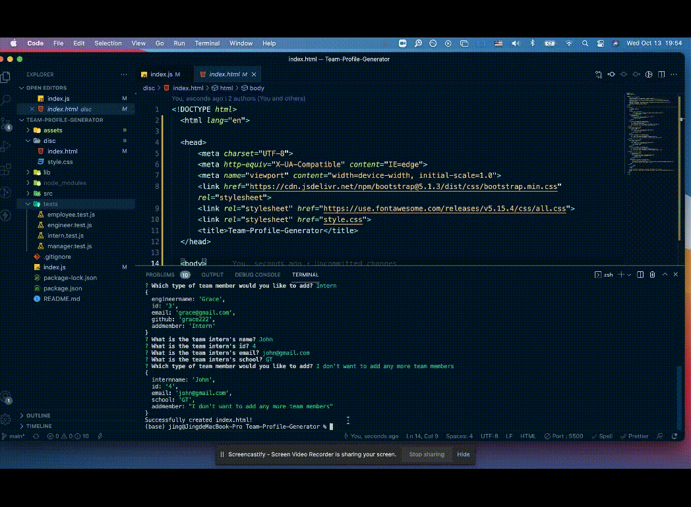

# Team-Profile-Generator


## Description

In this project, my task is to build a Node.js command-line application that takes in information about employees on a software engineer team, then generates an HTML webpage that displays summaries for each person.

## URL Link to GitHub Repository

https://github.com/jingwang6028/Team-Profile-Generator

## Mock-Up Image

A walkthrough gif demonstrating the functionality of the application.


## Table of Contents

- [Requirements](#Requirements)
- [Installation](#installation)
- [Tests](#tests)
- [License](#license)
- [Questions](#questions)

## Requirements

```
Node.js
npm
```

## Installation

To install necessary dependencies, run the following command:

```
npm init -y
npm i inquirer
npm i jest
```

## Tests

To run tests, run the following command:

```
npm run test
```

A gif to demonstrating the test functionality.


## License

This project is licensed under the MIT license.

## Questions

If you have any questions about the repo, open an issue or contact me directly at jingwang6028@gmail.com. You can find more of my work at [jingwang6028](https://github.com/jingwang6028).
